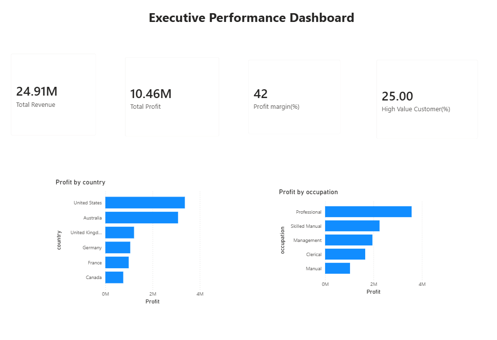
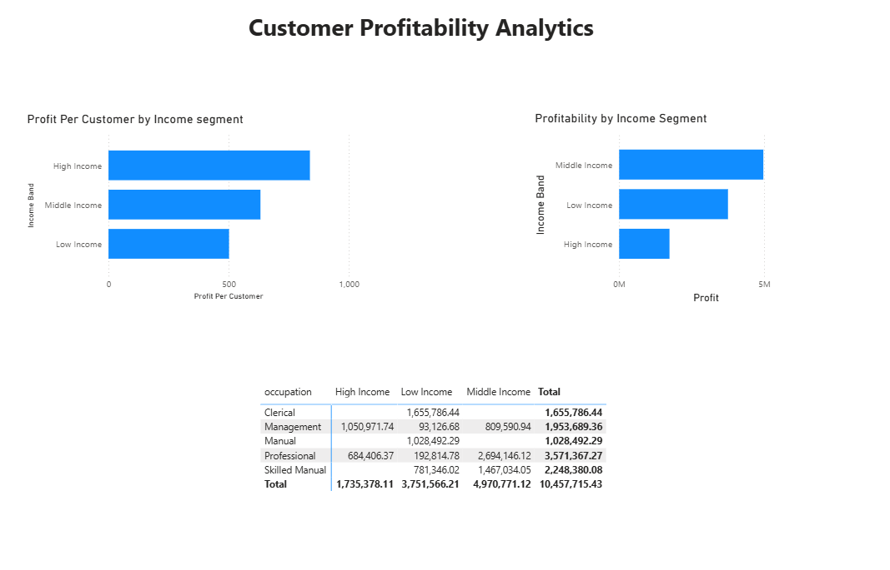
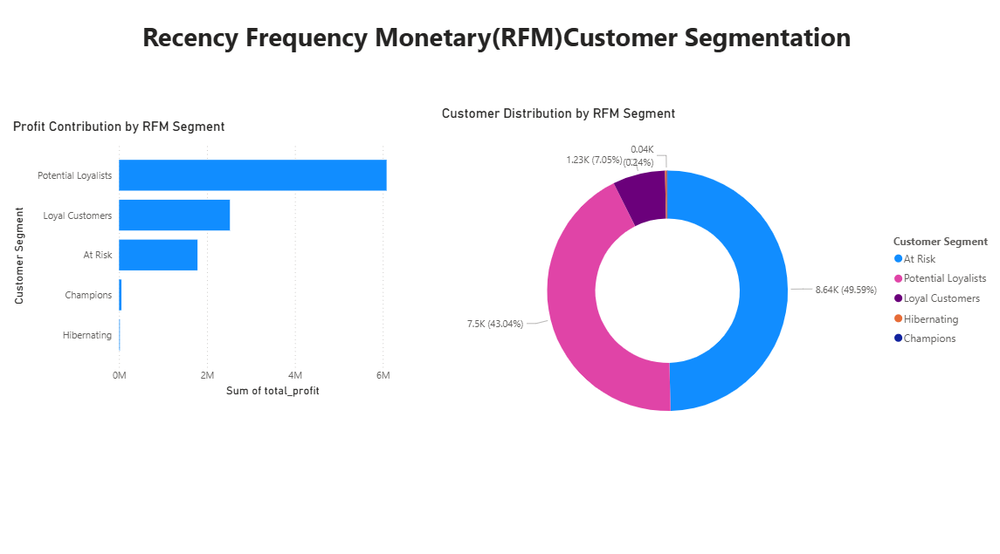
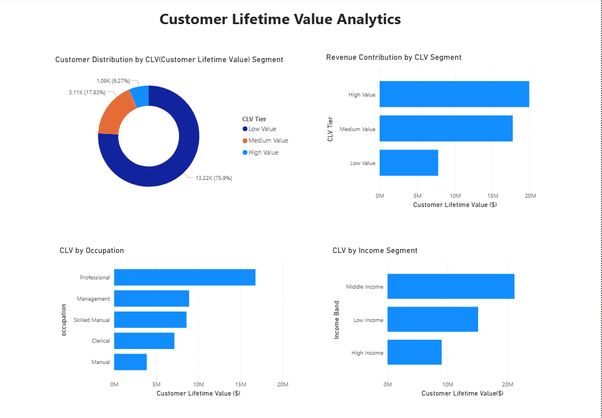
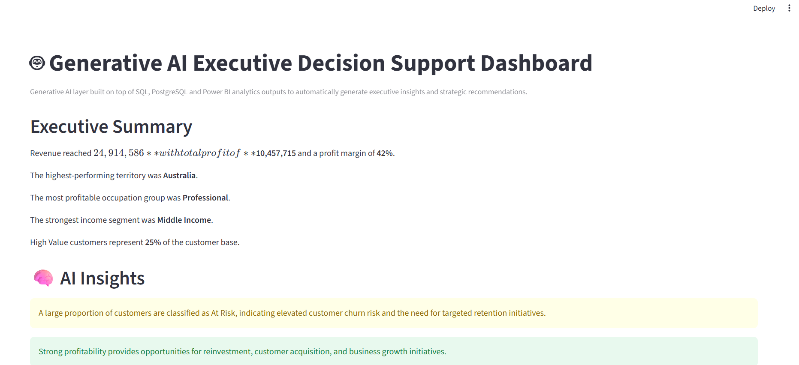
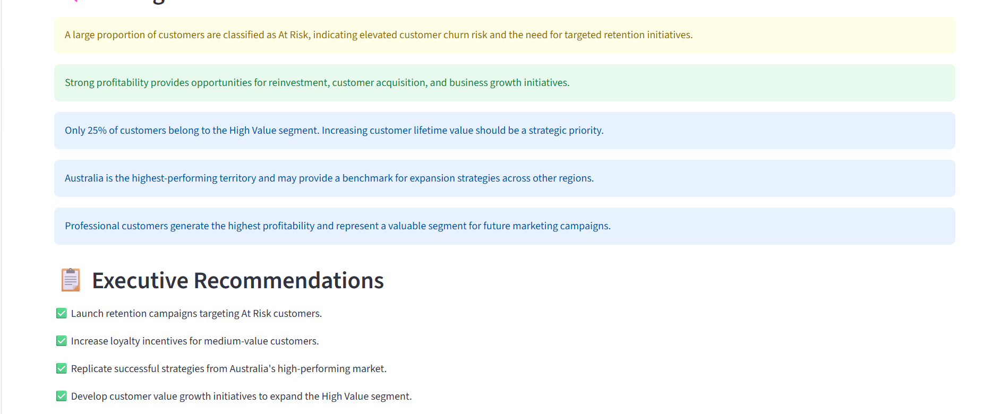
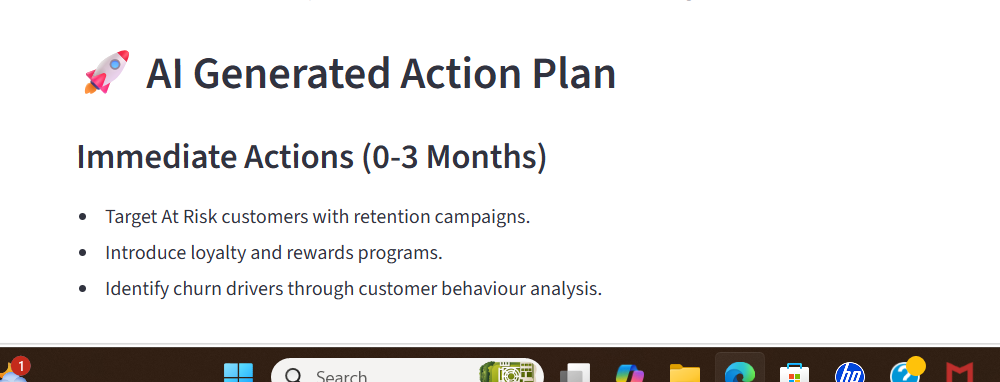

# AI_Powered-Customer-Profitability-Executive-Analytics-Platform-
# 🤖 AI-Powered Customer Profitability & Executive Insights

## Project Overview

This project delivers an end-to-end customer profitability analytics solution built using PostgreSQL, SQL, Power BI, Python and Streamlit.

The solution combines data warehousing, customer segmentation and executive reporting to identify profitability drivers, customer value opportunities and retention risks.

A Generative AI insights layer was developed using Streamlit to automatically transform analytical outputs into executive summaries, business insights and strategic recommendations.

---

## Business Problem

AdventureWorks needs to better understand its customers and profitability to support data-driven commercial decisions. While sales data exists across multiple years and customer segments, it is difficult for executives to quickly identify which customers generate the greatest long-term value, where profitability is concentrated, and which customer groups require retention efforts.

This analytics platform answers key commercial questions such as:

Which customers generate the highest profit?
Which customer segments are most valuable over time?
Which customers show signs of becoming inactive?
Which territories and demographic groups drive the strongest profitability?
Where should marketing and retention investments be prioritised?

---

## Solution Architecture

AdventureWorks Dataset
↓
PostgreSQL Data Warehouse
↓
Fact & Dimension Model
↓
Customer Profitability Analysis
↓
RFM Segmentation
↓
CLV Segmentation
↓
Power BI Executive Dashboard
↓
Generative AI Executive Insights (Streamlit)

---

## Key Results

| Metric               | Value        |
| -------------------- | ------------ |
| Revenue              | $24.9M       |
| Profit               | $10.5M       |
| Profit Margin        | 42%          |
| Customers Analysed   | 17,400+      |
| High Value Customers | 25%          |
| Largest RFM Segment  | At Risk      |
| Top Territory        | Australia    |
| Top Occupation       | Professional |

---

## Analytics Components

### Customer Profitability Analysis

* Analysed revenue, profit and margin across customer demographics.
* Identified high-performing occupations and income segments.
* Evaluated profitability contribution across customer groups.

### (Recency Frequency Monetary)RFM Segmentation

Customers were segmented into:

* Champions
* Loyal Customers
* Potential Loyalists
* At Risk
* Hibernating

The analysis identified At Risk customers as the largest segment, highlighting retention opportunities.

### Customer Lifetime Value (CLV)

Customers were classified into:

* High Value
* Medium Value
* Low Value

Quartile-based segmentation was used to create balanced and data-driven customer value tiers.

---

## Generative AI Insights Layer

A Streamlit-based Generative AI layer was developed to:

* Generate executive summaries automatically.
* Identify key business insights.
* Recommend strategic actions.
* Translate dashboard metrics into business recommendations.

Example insights include:

* Customer churn risk identification.
* Retention strategy recommendations.
* Territory expansion opportunities.
* High-value customer growth initiatives.

---

## Tools & Technologies

### Data Engineering

* PostgreSQL
* SQL

### Business Intelligence

* Power BI
* DAX

### Analytics

* Customer Profitability Analysis
* RFM Segmentation
* CLV Analysis

### Programming

* Python
* Pandas
* Streamlit

### AI

* Generative AI Insights
* Automated Executive Recommendations

---

## Dashboard Screenshots

### Executive Dashboard

### Customer Profitability Analysis

### RFM Segmentation

### CLV Analysis

### AI Executive Insights Application

---

## Project Outcomes

* Built a dimensional data warehouse using PostgreSQL.
* Analysed $24.9M revenue and $10.5M profit across 17,400+ customers.
* Developed customer profitability, RFM and CLV analytics.
* Created executive Power BI dashboards.
* Implemented a Generative AI insight layer using Streamlit.
* Automated executive summaries and strategic recommendations.
